# CI/CD and Agent Routing Architecture

## Supported result

The delivery system gives the same changed files to one versioned routing policy. Local
hooks and CI use that policy to select deterministic checks.

Agents can propose work and evidence. They do not decide whether a pull request passes,
approve their own changes, merge code, or deploy from a pull request.

## Delivery sequence

```mermaid
flowchart LR
    A[Ready work unit] --> B[Agent or contributor plan]
    B --> C[Local commit hook]
    C --> D[Local routed push hook]
    D --> E[Pull request submission check]
    E --> F[Changed-file router]
    F --> G[Selected subsystem checks]
    G --> H[Managed advisory review]
    H --> I[Human review]
    I --> J[Protected merge]
    J --> K[Full main-branch CI]
    K --> L[Tested client artifact]
    L --> M[Pages deployment]
```

## Deterministic boundary

A deterministic gate returns the same result for the same repository state, toolchain,
inputs, and policy. These gates do not call a language model.

The repository fixes these inputs:

- npm and uv lockfiles fix dependency resolution.
- `.node-version` and `etl/.python-version` fix runtime versions.
- GitHub Actions use full commit hashes.
- GitHub-hosted jobs use the named Ubuntu 24.04 image.
- `delivery-routing.json` fixes changed-path and agent-routing rules.
- tests fix expected classifier and submission behavior.
- deployment consumes the newest reachable, unexpired client artifact from successful CI.

The Ubuntu image can receive platform updates under the same image name. A container
digest is required if the project later needs byte-identical operating-system inputs.

Dependency advisory data changes over time. Dependabot monitors that data outside the
deterministic build gate. A maintainer evaluates each advisory and proposed update.

## Pull request checks

The `CI` and `Submission` workflows start when a pull request against `main` opens,
reopens, receives a new head revision, or is edited. The edit event ensures that a pull
request retargeted to `main` receives both required contexts. A metadata-only edit can
repeat the checks, but it cannot change the commit-bound submission result. Neither
workflow uses path filters because a filtered required workflow can remain pending.

| Job | Selection | Result |
|---|---|---|
| `Route changes` | Always | Tests the policy and classifies the diff. |
| `Submission record v1` | Always | Checks the committed `.github/submission.md` without changing application contexts. |
| `Prose` | Always | Checks prose, submissions, work-unit schemas, and review policy. |
| `Frontend` | Routed | Installs locked npm dependencies, then lints and builds the client. |
| `Server` | Routed | Installs locked dependencies, lints and builds, then starts the server and checks `/ping`. |
| `ETL` | Routed | Installs the locked uv environment, then runs Ruff and pytest. |

The required check names are `Submission record v1`, `Prose`, `Frontend`, `Server`, and
`ETL`. A job-level condition reports a successful skip when its subsystem is not
affected.

The CI concurrency key includes the event kind and the pull request number or exact
commit. Pull-request revisions can cancel their predecessor. Each main-branch commit
uses a distinct group, so an older rerun cannot evict CI for the current commit.

The submission workflow has a separate concurrency group keyed by head commit. It
cannot cancel code CI or publish replacement application contexts. Pull requests that
share a head commit join the same serialized group.

The read-only `pull_request_target` workflow runs from the default branch and checks
out the exact trusted workflow revision through `github.workflow_sha`. The workflow
fetches the exact head commit metadata and selects its first parent. It then fetches
`.github/submission.md` from that parent and the exact head through the Contents API.
It validates both responses, requires different blob identifiers, and decodes the head
file as inert data. It never executes pull request code. Its token can publish commit
statuses but cannot write repository contents.

The changed-blob rule rejects a record inherited from the head's first parent. Thus,
the tip commit must update the evidence. The rule uses the first parent for a merge
head and fails closed for a root commit or missing parent record. It cannot detect a
cosmetic edit or decide whether the evidence is true.

A human reviewer must compare the record with the diff. Before the workflow publishes
a result, it confirms the live
pull request still names the event head. A canceled or stale run publishes no result.

GitHub commit statuses belong to a commit, not to one pull request. The input record now
has that same identity. Two pull requests at one head commit share one result, even
when their base commits differ. Mutable pull request text does not affect the status.

The `Submission record v1` context freezes its terminal validation predicate and target
commit. A change to that result boundary requires a new versioned context and a
protected-branch migration. An old workflow revision can then write only its retired
context. Trigger coverage and intermediate-state safety corrections can retain the
context when the terminal predicate and target commit remain unchanged.

This status gate is not yet merge-queue compatible. The current workflow does not
handle `merge_group` or publish `Submission record v1` on the temporary merge-group
commit. Keep merge queues disabled while this context is required. Add and test that
event path before the team enables a merge queue.

The router fails closed:

- an unknown path selects all application checks.
- a routing policy, hook, or workflow change selects all application checks.
- a routing job failure causes each application check to run and fail immediately.
- a push to `main`, merge-queue check, or manual run selects all application checks.

These rules preserve required check names and prevent a classifier failure from hiding
an application failure.

## Local hooks

The pre-commit framework installs two hook stages from `.pre-commit-config.yaml`.

Python hooks use a pre-commit Python environment and its `python` executable. This
avoids requiring a system `python3` alias. Schema validation uses a pinned `uvx` tool.
The local review runner executes from a trusted base commit. It reads routing policy
from that resolved commit and treats the proposed tree as data. The quality-check runner
resolves external commands through `PATH`, including Windows command launchers, and
propagates nonzero exits.

The commit stage checks prose-bearing changed files and validates changed work-unit
manifests. It also runs routing tests when a routing, hook, or CI file changes.

The commit stage also tests the local review runner when review rules, review skills,
or model routes change. The tests inspect routing without invoking a model.

The push stage uses the source and destination commit IDs supplied by pre-commit for
the push. It runs the full prose scan, schema validation, routing tests, and applicable
application checks. The Server route includes its startup smoke test. The push stage
also requires the pushed head to update the record from its first parent.
Manual execution compares `HEAD` with `origin/main` unless the caller supplies another
range. When pre-commit requests all files without a commit range, the runner preserves
that request and runs every application check.

The checks execute in the current worktree. The runner stops when the pushed commit is
not checked out or the worktree is dirty. Either state would produce evidence for
content outside the pushed commit. Push one clean, checked-out branch at a time for
exact local validation. CI validates the pull request head and remains the merge
evidence of record.

The local hook does not run `npm ci` because that command replaces the local dependency
tree. Contributors install locked dependencies before the hook runs. CI creates clean
environments and remains the merge evidence of record.

CI disables npm audit and funding requests during installation. Dependabot owns advisory
monitoring, so the required install step does not depend on changing advisory data.

## Model routing

The agent router is advisory. It selects the least costly executor that can produce
evidence within the task boundary.

| Route | Default executor | Required boundary |
|---|---|---|
| Mechanical | Script, compiler, linter, validator, or test | Exact pass or fail rule |
| Repeated method | Repository skill or template | Stable project method |
| Bounded Green | GPT-5.6 Luna at low effort | Narrow, reversible, objective check |
| Bounded Yellow | GPT-5.6 Terra at medium effort | Named contract and mentor checkpoint |
| Integration | GPT-5.6 Sol at high effort | Ambiguous or cross-subsystem synthesis |
| Red specialist | Specialist plus accountable human | Security, privacy, migration, or destructive risk |
| Intent | Accountable human | Priority, scope, trade-off, approval, or merge |

A Red lane keeps exact mechanical tasks on deterministic tools. It adds the required
human checkpoint before implementation and routes judgment to a specialist.

Current OpenAI guidance describes Luna for cost-sensitive workloads, Terra for balanced
cost and intelligence, and Sol for complex professional work. The repository records
these names as reviewed defaults, not permanent assumptions.

An orchestrator must inspect the route, send minimum context, cap the requested output,
and provide an objective validation command. The orchestrator verifies the result before
integration.

Model output never becomes a required status check. A deterministic tool or human review
must verify every consequential agent claim.

## Advisory review boundary

Managed Codex Code Review is the selected pull request event hook. It reads the root
and nearest `## Code Review Rules` sections. It posts a standard GitHub review when the
integration is enabled.

The pilot configures `Review all PRs`, uses the experimental `Smart detect` trigger,
and disables exhaustive review. Personal credit overrun stays disabled. A maintainer
requests another review after a material update with `@codex review` when smart
detection does not start one. This policy limits repeated review cost without leaving
review responsibility only with the pull request author.

The team should change the trigger to `On every push` if the pilot shows that smart
detection misses material changes. It should enable exhaustive review only when the
added findings justify the extra review cost.

Use `@codex review` as the required managed hook when automatic review is unavailable.
Use human review when the repository cannot use the managed integration.

The managed service selects its own model. The repository model routes apply to local
and delegated review. The local runner uses Luna for bounded Green changes, Terra for
bounded Yellow changes, and Sol for cross-subsystem review.

The local runner requires a declared risk lane. Trusted-base path rules can raise that
lane but cannot lower it. This check catches clear under-routing. Examples include
authentication code, every GitHub Actions workflow, and migration code declared Green.
Every workflow uses Red review because permissions and authorization can change inside
any workflow file. The path check does not replace a human risk decision, and a
client-side hook cannot enforce policy against `--no-verify`.

The managed reviewer does not receive a repository API secret through GitHub Actions.
The repository does not check out contributor code inside a privileged review workflow.
This boundary removes the fork-secret and untrusted-execution paths from repository CI.

The closest alternative is `openai/codex-action` with an organization API key. The
team can revisit that option when it needs structured findings, an automated gate, and
an owner for secret, budget, and prompt-injection controls.

See `docs/decisions/0001-pr-review-hooks.md` for the complete decision and limits.

## Submission and explainability

Every pull request follows `docs/CODE_CHANGE_STANDARD.md`. The record includes the claim,
evidence, reasoning, selected design, rejected alternative, and limits. It also includes
the comprehension path, refactor boundary, and review question.

The `Submission record v1` job enforces the required structure in the exact head revision.
The `Prose` job enforces selected language rules in repository files. Human review
decides whether the stated why and why-not match the code and evidence.

Comments explain non-obvious reasons and invariants. Names, types, interfaces, and tests
explain ordinary behavior. This rule avoids comments that repeat implementation syntax.

## Deployment

The deployment workflow starts only after a successful push-triggered `CI` workflow on
`main`. The completion event is a reconciliation signal, not the artifact identity.
The job resolves live `main` and requires successful push CI for that exact commit. It
then searches successful `main` runs from newest to oldest. It selects the first
unexpired client artifact whose tested commit is an ancestor of live `main`. The run
identifier and tested commit identify that artifact.

Only successful push-CI completions on `main` share the serialized deployment group.
They do not cancel an active publisher. Pull request, manual, and failed CI completions
receive groups unique to their workflow-run identifiers. They skip reconciliation and
cannot cancel an active Pages publication.

A stale rerun therefore resolves current `main` instead of trusting its event artifact.
If current CI is incomplete or failed, reconciliation stops without an error. Completion
of successful current CI starts another reconciliation. A successful non-client commit
can carry the preceding tested client artifact forward because its CI run has no client
artifact of its own. This fallback never uses an artifact outside current `main` history.

A final live-reference check stops publication if `main` advances while the job waits or
prepares its artifact. A post-deploy check detects a race during publication. Successful
CI for the newer commit then starts the next serialized reconciliation.

The `Frontend` job builds and uploads `github-pages-client` during main-branch CI. The
deployment workflow downloads the newest reachable artifact by its successful run
identifier. It does not rebuild the client. The selected artifact can precede live
`main` only when later successful runs produced no newer client artifact.

The deploy job verifies `client/dist/index.html`, packages the Pages artifact, and uses
the Pages environment. Its token can read Actions and repository contents. It can write
Pages and request an identity token.

A failed CI run creates no qualifying deployment. A missing or expired artifact leaves
the previous Pages deployment unchanged. A new client build is required after all
reachable artifacts expire. A commit that arrives during publication can make the
active artifact briefly stale. The post-deploy guard reports that state, and newer
successful CI reconciles it. Intentional rollback requires a separate guarded procedure.

## Change and failure records

Use the pull request for a local design explanation. Add a decision record when the
change crosses a subsystem, public contract, durable state, or high-impact risk boundary.

Record a follow-up issue when a qualifier or rebuttal needs later work. Record a rollback
or incident in a runbook when production recovery requires more than a new deployment.

## Maintainer activation

Follow [the activation checklist](DELIVERY_ACTIVATION.md). After merge, confirm a
successful `CI` run and deployment on `main`. Validate `Submission record v1` on a
subsequent PR, because the submission workflow does not run on main pushes.
Configure `Submission record v1`, `Prose`, `Frontend`, `Server`, and `ETL` as required
checks in the protected-main ruleset after observing their results. Require branches to
be up to date before merge so a base change forces a new head and submission result.

Connect the repository in Codex settings. Confirm that it is team-enabled before you
enable automatic review. Otherwise, use `@codex review` on each representative change.

Keep the approval, last-push approval, resolved-thread, squash-merge, deletion, and
non-fast-forward protections. Do not enable a merge queue while `Submission record v1` is
required. The application checks support merge groups, but the submission gate does not.

Review routing paths, model defaults, false positives, CI minutes, and model usage after
the first three merged work units.

## Authoritative references

- [GitHub workflow filters and required checks](https://docs.github.com/en/actions/how-tos/write-workflows/choose-when-workflows-run/trigger-a-workflow)
- [GitHub job conditions](https://docs.github.com/en/actions/how-tos/write-workflows/choose-when-workflows-run/control-jobs-with-conditions)
- [GitHub required-check troubleshooting](https://docs.github.com/en/pull-requests/how-tos/merge-and-close-pull-requests/troubleshooting-required-status-checks)
- [Codex GitHub review](https://developers.openai.com/codex/integrations/github)
- [Codex local code review](https://learn.chatgpt.com/codex/code-review)
- [GitHub Actions security](https://docs.github.com/en/actions/reference/security/secure-use)
- [OpenAI model selection](https://developers.openai.com/api/docs/models)
