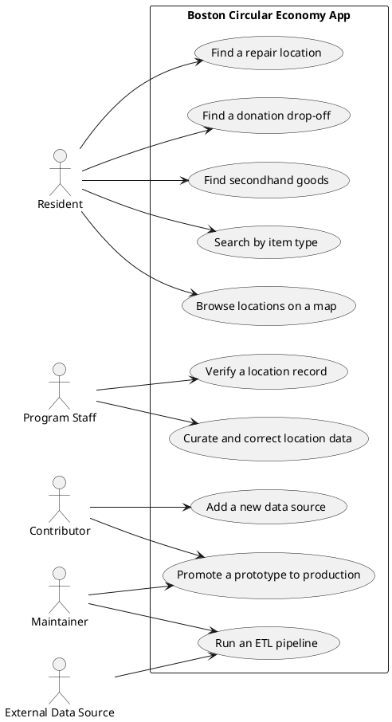
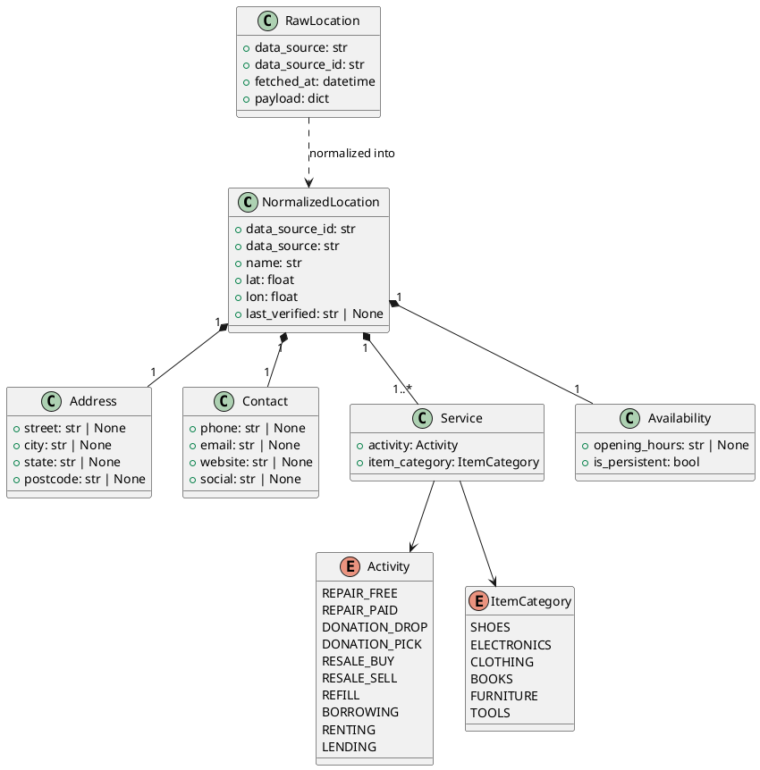
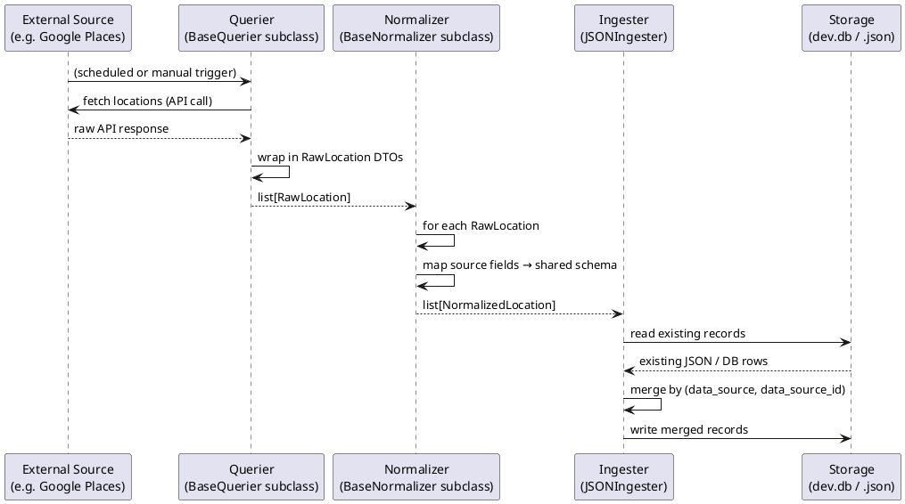

# DDD and UML: A Practical Tutorial Using the Boston Circular Economy App

## Who this is for

This document is for developers and project managers who are new to Domain-Driven Design (DDD) and UML but want to understand them well enough to contribute thoughtfully to this project. It uses the actual code in this repository as the teaching example throughout.

If you are a developer, you will recognize the code references. If you are a project manager, focus on the plain-English descriptions — the code snippets are there to show where the design decisions live, not to test you on syntax.

---

## Part 1: What is Domain-Driven Design?

### The core idea

Domain-Driven Design is an approach to software that says: **the most important thing to get right is your understanding of the problem you are solving**, not the technology you are using to solve it.

The "domain" is the subject area the software is about. For this project, the domain is the **circular economy** — the network of places in a city where people can repair, donate, borrow, buy secondhand, refill, or exchange goods instead of throwing them away.

DDD asks you to:

1. Learn the domain deeply — talk to users, understand the workflows
2. Build a shared vocabulary — use the same words in conversation, in code, and in documentation
3. Organize code around business concepts, not technical layers

### Why it matters for this project

This app is still early. The architecture choices made now will either make it easy or hard to grow the system later. DDD helps by giving us a way to name things clearly and decide what belongs together.

For example: in `etl/dtos.py`, the data pipeline uses domain terms directly — `Activity`, `Service`, `NormalizedLocation`, `Availability`. These are not made-up technical words. They map to real things people talk about when they describe the circular economy. That alignment is what DDD is trying to create.

---

## Part 2: Nouns, Verbs, and Where They Come From

Before writing any code, DDD practitioners talk to the people who understand the domain and listen carefully to the words they use. Then they sort those words into categories.

### Nouns → Entities and Value Objects

A **noun** in the domain becomes either an **entity** or a **value object**.

An **entity** is something with a unique identity that persists over time. Even if its details change, it is still the same thing. For example, "Beacon Hill Repair Cafe" is a location. Its phone number might change, its hours might change, but it remains the same location.

A **value object** is something described entirely by its values — it has no separate identity. An address is a good example. `74 Joy St, Boston, MA 02114` either matches an address or it doesn't. There is no "which 74 Joy St". If the address changes, you simply replace it with a new one.

Look at the code:

```python
# etl/dtos.py

class Address(BaseModel):
    street: str | None = None
    city: str | None = None
    state: str | None = None
    postcode: str | None = None
```

`Address` is a value object. It describes a location's address, but has no independent identity.

```python
class NormalizedLocation(BaseModel):
    data_source_id: str
    data_source: str
    name: str
    lat: float
    lon: float
    address: Address
    contact: Contact
    services: list[Service]
    availability: Availability
    last_verified: str | None = None
```

`NormalizedLocation` is the domain's closest thing to a full entity — a specific place with a unique identity (`data_source` + `data_source_id`), a name, coordinates, and a set of services it offers.

### Verbs → Activities and Services

A **verb** in the domain describes something a person can do or that happens in the system. In DDD, verbs often become:
- **Methods** on entities or services
- **Domain events** (things that have happened)
- **Commands** (things a user wants to do)

The `Activity` enum is a perfect example of domain verbs translated into code. Each value describes something a person does at a location:

```python
# etl/dtos.py

class Activity(str, Enum):
    REPAIR_FREE   = "repair_free"   # repair your items here for free
    REPAIR_PAID   = "repair_paid"   # repair your items here for a fee
    DONATION_DROP = "donation_drop" # drop off items you no longer need
    DONATION_PICK = "donation_pick" # pick up free items
    RESALE_BUY    = "resale_buy"    # buy secondhand items here
    RESALE_SELL   = "resale_sell"   # sell or consign your items here
    REFILL        = "refill"        # refill your own container here
    BORROWING     = "borrowing"     # borrow items here for free
    RENTING       = "renting"       # rent items here for a fee
    LENDING       = "lending"       # lend your items out through this location
```

This enum is a vocabulary decision — it says these are the recognized activities in this domain. Nothing outside this list is currently a first-class concept. That is a design choice, and it is exactly the kind of decision DDD helps you make consciously.

---

## Part 3: Actors — Who Does What?

An **actor** is anyone (person, organization, or external system) that interacts with the application. Before writing use cases or workflows, you need to know your actors.

For this project, the likely actors are:

| Actor | Role |
|---|---|
| **Resident** | A person in the Boston area looking for somewhere to repair an item, donate something, borrow a tool, etc. |
| **Program Staff** | City employees or nonprofit coordinators who manage listings, verify location data, and curate the directory. |
| **Maintainer** | A developer or architect who owns the codebase, merges PRs, and makes architectural decisions. |
| **Contributor** | A developer who adds new features, data sources, or fixes bugs, but may not have merge authority. |
| **External Data Source** | An API or dataset (Google Places, OpenStreetMap, Yelp, etc.) from which location data is pulled. It is an actor because it drives the ETL pipeline. |
| **Data Curator** | Someone — possibly a program staff member or volunteer — who reviews raw location data and approves or corrects it before it appears in the app. |

Notice that some of these actors have technical roles (Maintainer, Contributor) and some have domain roles (Resident, Program Staff, Data Curator). DDD wants you to keep both in view.

---

## Part 4: Entities, Value Objects, and Services in This Codebase

### Entities (current)

Things in the codebase that behave like entities — they have a unique identity and can change over time:

| Entity | Where it lives | Notes |
|---|---|---|
| `NormalizedLocation` | `etl/dtos.py` | The primary record in the pipeline. Identified by `data_source + data_source_id`. |
| `RawLocation` | `etl/dtos.py` | A snapshot of a location record as fetched from an external source, before normalization. Identified by `data_source + data_source_id + fetched_at`. |

### Value Objects (current)

Things that are fully described by their values, with no separate identity:

| Value Object | Where it lives | Notes |
|---|---|---|
| `Address` | `etl/dtos.py` | Street, city, state, postcode |
| `Contact` | `etl/dtos.py` | Phone, email, website, social |
| `Service` | `etl/dtos.py` | An activity + item category pair (e.g. "free electronics repair") |
| `Availability` | `etl/dtos.py` | Opening hours and whether the location is persistent |
| `Activity` | `etl/dtos.py` | An enum of recognized activity types |
| `ItemCategory` | `etl/dtos.py` | An enum of recognized item categories |

### Domain Services (current)

In DDD, a **domain service** is logic that doesn't naturally belong to a single entity. In this codebase, the pipeline stages are services:

| Service | Where it lives | What it does |
|---|---|---|
| `BaseQuerier` | `etl/base/querier.py` | Fetches raw location data from an external source |
| `BaseNormalizer` | `etl/base/normalizer.py` | Translates raw data into the shared schema |
| `BaseIngester` | `etl/base/ingester.py` | Persists normalized locations to a storage target |
| `JSONIngester` | `etl/json_ingester.py` | A concrete ingester that writes to a JSON file |

Each pipeline stage is an abstract base class that contributors subclass for each new data source. That is a clean service boundary.

---

## Part 5: Bounded Contexts

A **bounded context** is a section of the system where a particular vocabulary applies, and where the meaning of a term is consistent within that section. Different contexts can use the same word differently. Bounded contexts help you avoid confusion when a system grows.

Think of it like departments in a company. "Customer" means something slightly different in Sales, Support, and Finance — but within each department, everyone agrees what it means.

### Likely Bounded Contexts for This Project

The codebase is small enough today that strict context separation is not yet needed, but you can already see the natural seams:

---

#### Context 1: Location Data Pipeline (ETL)

**Folder:** `etl/`

**What it cares about:** Getting raw location data from external sources, transforming it into a normalized schema, and storing it.

**Key vocabulary:** RawLocation, NormalizedLocation, DataSource, Querier, Normalizer, Ingester, Activity, Service, ItemCategory, Availability.

**Actors in this context:** External Data Sources, Contributors (who build new pipelines), Maintainers.

**Boundary:** This context talks in terms of data fidelity, schema, and transformation. It does not care about user experience or what a resident wants to find.

---

#### Context 2: User-Facing Discovery (Client)

**Folder:** `client/`

**What it cares about:** Showing residents useful results so they can find a repair cafe, donation spot, or tool library near them.

**Key vocabulary:** Location (as displayed to a user), Search, Filter, Result, Map, Category, Activity.

Note: "Activity" appears in both contexts, but its meaning is slightly different. In the ETL context, it is a precise enum value. In the client context, it might be a human-readable label ("Free repair", "Donate items"). DDD would say these are related but distinct uses of the same word across context boundaries.

**Actors in this context:** Residents, Program Staff (who may want to view and verify).

**Boundary:** This context cares about what the user sees and does. It does not care about how data was fetched or normalized.

---

#### Context 3: Data Curation and Verification (Future)

**Folder:** Not yet built.

**What it cares about:** Reviewing location records for accuracy — is this place still open? Are the services listed correct? Has this been recently verified?

**Key vocabulary:** Verification, LastVerified, PrototypeStatus, DataQuality, CurationQueue.

**Actors in this context:** Program Staff, Data Curators, possibly automated scrapers.

The field `last_verified` in `NormalizedLocation` (`etl/dtos.py`, line 83) is a placeholder for this future context. It is already in the schema, but there is no UI or workflow for it yet.

---

#### Context 4: Developer/Prototype Sandbox (Dev)

**Folder:** `client/src/pages/dev/`

**What it cares about:** Experimenting with features before they are stable enough to be part of the main product.

**Key vocabulary:** Prototype, PromotionCandidate, DevRoute, MockData.

The fuzzy-search prototype in `client/src/pages/dev/fuzzy-search/` is a good example. It works with mock data today. Promoting it to production would mean connecting it to real location data and moving it out of the dev section.

---

## Part 6: UML — What It Is and How to Use It

### The core idea

UML (Unified Modeling Language) is a standard set of visual diagram types for describing software systems. Think of it as a shared drawing vocabulary — if you know UML, you can read a diagram someone else drew without having to ask what each symbol means.

You do not need to use UML everywhere. Use it where a picture genuinely helps more than words. The most useful diagram types for this project are:

1. **Use Case Diagrams** — Who does what with the system
2. **Class Diagrams** — How data is structured and related
3. **Sequence Diagrams** — How a flow of actions happens step by step

### How DDD and UML complement each other

DDD gives you the vocabulary and the structure. UML gives you a way to draw that structure visually. They are not the same thing, but they work well together:

- Use DDD analysis to find your entities, value objects, services, and bounded contexts.
- Use UML class diagrams to show how those entities relate to each other.
- Use UML use case diagrams to show which actors can do what.
- Use UML sequence diagrams to show how the ETL pipeline moves data through the system.

Neither requires special tools. The diagrams in this document use PlantUML-style text notation that can be rendered by many tools including VS Code extensions, draw.io, and GitHub's Mermaid renderer.

---

## Part 7: Use Case Diagram

A use case diagram shows actors (people or systems) and what they can do with the system. It answers the question: "Who can do what?"

The ovals are use cases. The stick figures are actors. Lines connect actors to the use cases they participate in.



**How to read this:** A Resident interacts with discovery use cases (1–5). Program Staff interacts with curation and verification (6, 10). External Data Sources drive the ETL pipeline (7). Contributors build new integrations (8) and promote prototypes (9).

---

## Part 8: Class Diagram

A class diagram shows the structure of the data and how pieces relate. The following shows the core domain model in `etl/dtos.py`.



**How to read this:** `NormalizedLocation` is the main entity. It contains (`*--`) an address, contact, list of services, and availability. Each `Service` references an `Activity` and an `ItemCategory`. `RawLocation` is the upstream form that gets normalized into a `NormalizedLocation`.

The diamond (`*--`) means composition: if a `NormalizedLocation` is deleted, its `Address`, `Contact`, and `Availability` are deleted with it. They have no life of their own. This confirms they are value objects, not entities.

---

## Part 9: Sequence Diagram — ETL Pipeline

A sequence diagram shows a flow of actions over time. It answers the question: "What happens, in what order, and who is involved?"

Read it from top to bottom. Each arrow is a message or method call.



**How to read this:** The Querier fetches raw data from an external source and wraps it in `RawLocation` objects (a boundary DTO). The Normalizer maps source-specific field names to the shared schema and produces `NormalizedLocation` objects (another boundary DTO). The Ingester merges those records into storage. The two DTO types in `etl/dtos.py` are the handoff points between pipeline stages — that is why the comment in the code calls them "pipeline boundaries."

---

## Part 10: What Is Implemented vs. What Is Likely Future Work

This is an early-stage project. It is important to be honest about what currently exists and what is designed but not yet built.

### What currently exists

| Area | What is there |
|---|---|
| `etl/dtos.py` | Full domain model for the location data pipeline |
| `etl/base/` | Abstract base classes for Querier, Normalizer, Ingester |
| `etl/pipelines/example/` | A working example pipeline with mock data |
| `etl/json_ingester.py` | A concrete ingester that writes normalized locations to a JSON file |
| `server/` | A minimal Express server with a `/ping` health check and a SQLite connection |
| `client/` | A React/Vite app with a home page and a dev/prototypes section |
| `client/.../fuzzy-search/` | A prototype fuzzy-search UI using mock item data |
| `data-explorations/` | Raw sample data from Google Places and OpenStreetMap |

### What is designed but not yet built

| Area | What is missing |
|---|---|
| Real data sources | No production Querier for Google Places or OpenStreetMap yet (only exploration samples exist in `data-explorations/`) |
| API serving locations | The server has no endpoint that returns location data to the client |
| Map-based UI | No map view in the client yet |
| Verification workflow | `last_verified` exists in the schema but there is no UI or process for curating/verifying records |
| User search connected to real data | Fuzzy search prototype uses mock items, not real locations |
| Donation and activity filtering | The `Activity` and `ItemCategory` enums are defined, but no UI filters exist yet |

---

## Part 11: Putting It All Together

Here is the DDD analysis of this project in summary form.

**Domain:** Circular economy services in the Boston area.

**Core mission:** Help residents find places to repair, donate, borrow, buy secondhand, and refill, so fewer goods end up in the trash.

**Primary entity:** `NormalizedLocation` — a verified, normalized record for a specific place that offers one or more circular economy services.

**Key value objects:** `Address`, `Contact`, `Service`, `Availability`.

**Key enums (controlled vocabularies):** `Activity`, `ItemCategory`. These define the shared language of the domain.

**Pipeline services:** `Querier` (fetch), `Normalizer` (transform), `Ingester` (store).

**Natural bounded contexts:**
1. Location Data Pipeline (ETL) — data quality and transformation
2. User-Facing Discovery (Client) — search and display
3. Data Curation and Verification (Future) — editorial quality control
4. Developer/Prototype Sandbox (Dev) — experimentation before promotion

**Primary actors:** Resident, Program Staff, External Data Source, Contributor, Maintainer, Data Curator.

**Key design decisions visible in the code:**
- The two-stage DTO boundary (`RawLocation` → `NormalizedLocation`) keeps source-specific details out of the application domain.
- The `Activity` enum is explicit and controlled, meaning new activity types must be a conscious decision, not just a free-text field.
- The `Service` type is a combination of Activity + ItemCategory, which is exactly how a real user thinks about a place: "This is where I can get free electronics repair."

---

## Further Reading

- `docs/product/glossary.md` — Plain-English definitions of all core domain terms
- `docs/product/use-cases.md` — Detailed use cases for each actor
- `docs/product/customer-journeys.md` — Step-by-step journey maps for common scenarios
- `etl/dtos.py` — The most information-dense single file in the codebase for understanding the domain model
- `etl/base/` — The three pipeline stage abstractions (Querier, Normalizer, Ingester)
- `etl/pipelines/example/` — The example pipeline that shows how a new data source gets wired up
