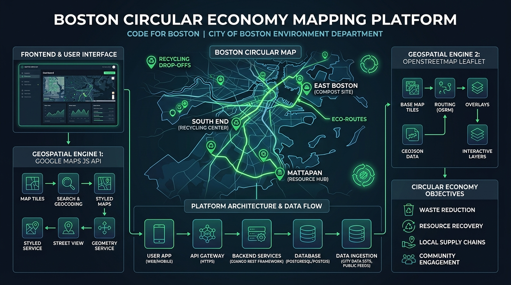

# Boston Circular Economy Repository (`boston-circular-economy`) — Master Developer Mapping Playbook

> **Context**: Partnering with the Circular Economy team within the **City of Boston Environment Department**  
> **Repository**: [`hwillGIT/boston-circular-economy`](https://github.com/hwillGIT/boston-circular-economy) (Forked from `codeforboston/boston-circular-economy`)

---

## 1. Repository Architecture & Mapping Integration Blueprint

The `boston-circular-economy` repository uses a full-stack JavaScript architecture with python data pipelines:

```
boston-circular-economy/
├── client/             # React front-end mapping UI (Google Maps SDK & Leaflet/OSM)
├── server/             # Express Node.js API server (Google Places / Routes & Overpass proxy)
├── etl/                # Python scripts for ingesting Boston Open Data & spatial GeoJSON
└── data-explorations/  # Jupyter notebooks for spatial equity & neighborhood waste analysis
```



---

## 2. Boston Geographic Configuration

All map canvas viewports and spatial queries are centered on Boston, MA:

```javascript
// Boston Geographic Presets
const BOSTON_CENTER = { lat: 42.3601, lng: -71.0589 }; // City Hall Plaza
const BOSTON_BOUNDS = {
  south: 42.2270, // Readville / Hyde Park
  west: -71.1912,  // West Roxbury
  north: 42.3968, // Charlestown / East Boston
  east: -70.9860   // Boston Harbor / Logan
};
```

---

## 3. Client-Side Implementation (`client/`)

### Option A: Google Maps JavaScript API with Advanced Markers
Place this inside your React/Vue client component (`client/src/components/BostonMap.jsx`):

```javascript
import { useEffect, useRef } from "react";

export function BostonGoogleMap() {
  const mapRef = useRef(null);

  useEffect(() => {
    async function initMap() {
      // Dynamic Library Import
      const { Map } = await window.google.maps.importLibrary("maps");
      const { AdvancedMarkerElement, PinElement } = await window.google.maps.importLibrary("marker");

      const map = new Map(mapRef.current, {
        zoom: 12,
        center: { lat: 42.3601, lng: -71.0589 },
        mapId: "BOSTON_CIRCULAR_MAP_ID", // Configured in Cloud Console
      });

      // Sample Boston Recycling Drop-Off Locations
      const bostonLocations = [
        { name: "South End Eco Hub", lat: 42.3438, lng: -71.0734, type: "E-Waste" },
        { name: "East Boston Drop-Off", lat: 42.3702, lng: -71.0389, type: "Compost" },
        { name: "Mattapan Repair Cafe", lat: 42.2771, lng: -71.0915, type: "Textiles" },
        { name: "Charlestown Recycle Center", lat: 42.3782, lng: -71.0602, type: "Metals" }
      ];

      bostonLocations.forEach(loc => {
        const pin = new PinElement({
          background: "#10b981",
          borderColor: "#06b6d4",
          glyphColor: "#ffffff"
        });

        new AdvancedMarkerElement({
          map,
          position: { lat: loc.lat, lng: loc.lng },
          title: loc.name,
          content: pin.element
        });
      });
    }

    initMap();
  }, []);

  return <div ref={mapRef} style={{ width: "100%", height: "600px", borderRadius: "12px" }} />;
}
```

### Option B: OpenStreetMap (OSM) + Leaflet.js
For zero-API-cost open data mapping in `client/src/components/BostonOSMMap.jsx`:

```javascript
import { useEffect } from "react";
import L from "leaflet";
import "leaflet/dist/leaflet.css";

export function BostonOSMMap() {
  useEffect(() => {
    // Center map on Boston, MA
    const map = L.map("leaflet-boston-map").setView([42.3601, -71.0589], 12);

    // OpenStreetMap Standard Tiles
    L.tileLayer("https://tile.openstreetmap.org/{z}/{x}/{y}.png", {
      maxZoom: 19,
      attribution: '&copy; <a href="http://www.openstreetmap.org/copyright">OpenStreetMap</a>'
    }).addTo(map);

    // Boston Eco Hub Markers
    const customIcon = L.divIcon({
      className: "boston-eco-pin",
      html: '<div style="background:#10b981; color:#000; border-radius:50%; width:32px; height:32px; display:flex; align-items:center; justify-content:center; font-weight:bold;">♻️</div>',
      iconSize: [32, 32]
    });

    L.marker([42.3438, -71.0734], { icon: customIcon })
      .addTo(map)
      .bindPopup("<b>South End Eco Hub</b><br>City of Boston Environment Dept.");
  }, []);

  return <div id="leaflet-boston-map" style={{ width: "100%", height: "600px", borderRadius: "12px" }} />;
}
```

---

## 4. Server-Side Overpass & Places API Proxy (`server/`)

To protect Google API keys and avoid rate limiting when querying OpenStreetMap, implement proxy routes in `server/routes/api.js`:

```javascript
const express = require("express");
const router = express.Router();
const fetch = require("node-fetch");

// 1. Proxy Query to Overpass API for Boston Recycling Tags
router.get("/osm/recycling-nodes", async (req, res) => {
  try {
    // Scoped to Boston, MA bounding box [South, West, North, East]
    const overpassQuery = `
      [out:json][timeout:25];
      (
        node["amenity"="recycling"](42.2270,-71.1912,42.3968,-70.9860);
        way["amenity"="recycling"](42.2270,-71.1912,42.3968,-70.9860);
      );
      out body center;
    `;

    const response = await fetch("https://overpass-api.de/api/interpreter", {
      method: "POST",
      body: "data=" + encodeURIComponent(overpassQuery)
    });

    const data = await response.json();
    res.json(data);
  } catch (error) {
    res.status(500).json({ error: "Failed to fetch Boston OSM recycling data" });
  }
});

module.exports = router;
```

---

## 5. Python Spatial ETL Script (`etl/`)

For processing Boston Open Data shapefiles / GeoJSON in `etl/process_boston_data.py`:

```python
import json
import requests

def fetch_and_clean_boston_recycle_data():
    """Fetch OpenStreetMap recycling nodes in Boston and clean GeoJSON format."""
    overpass_url = "https://overpass-api.de/api/interpreter"
    boston_bbox_query = """
    [out:json];
    node["amenity"="recycling"](42.2270,-71.1912,42.3968,-70.9860);
    out body;
    """
    
    response = requests.post(overpass_url, data={'data': boston_bbox_query})
    osm_data = response.json()
    
    features = []
    for elem in osm_data.get('elements', []):
        feature = {
            "type": "Feature",
            "geometry": {
                "type": "Point",
                "coordinates": [elem['lon'], elem['lat']]
            },
            "properties": {
                "id": elem['id'],
                "name": elem.get('tags', {}).get('name', 'Boston Drop-off Point'),
                "recycling_type": elem.get('tags', {}).get('recycling_type', 'general')
            }
        }
        features.append(feature)
        
    geojson = {
        "type": "FeatureCollection",
        "features": features
    }
    
    with open("client/public/boston_recycling.geojson", "w") as f:
        json.dump(geojson, f, indent=2)
        
    print(f"Successfully processed {len(features)} Boston circular economy locations!")

if __name__ == "__main__":
    fetch_and_clean_boston_recycle_data()
```

---

## 6. Accessing the Interactive Boston Sandbox

The web sandbox has been updated with real Boston coordinates and presets:

- **Web App**: [index.html](file:///C:/Users/huber/.gemini/antigravity/scratch/google_maps_circular_economy_guide/index.html)
- **Features**: Live Boston map view, Overpass QL tag generator for Boston, and code snippets for `client/`, `server/`, and `etl/`.
