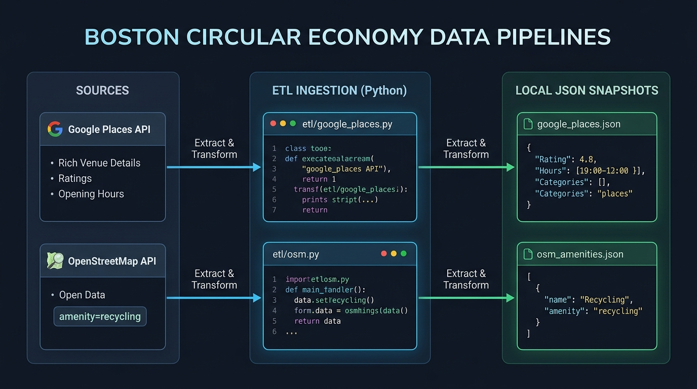
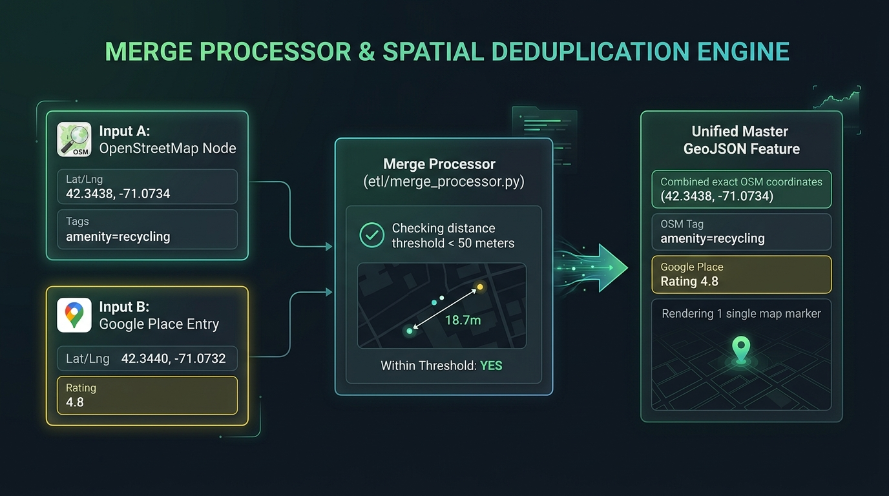

# Boston Circular Economy: Team Architectural Decision Records (ADRs)

> **Repository Context**: [`codeforboston/boston-circular-economy`](https://github.com/hwillGIT/boston-circular-economy)  
> **Target Audience**: Developers joining the team who need a clear breakdown of formal architectural decisions.

---

## 1. Boston Circular Economy Data Pipelines

Below is the complete visual architecture preserving all interior box details with clean 1-to-1 parallel arrows, valid Python code text, and formatted JSON `{}` syntax:



### Demystifying the 3 Pipeline Columns & Arrows

```
COLUMN 1: SOURCES          COLUMN 2: ETL INGESTION        COLUMN 3: LOCAL SNAPSHOTS
┌───────────────────┐      ┌─────────────────────────┐     ┌─────────────────────┐
│ Google Places API │ ────►│ etl/google_places.py    │────►│ google_places.json  │
└───────────────────┘      └─────────────────────────┘     └─────────────────────┘
┌───────────────────┐      ┌─────────────────────────┐     ┌─────────────────────┐
│ OpenStreetMap API │ ────►│ etl/osm.py              │────►│ osm_amenities.json  │
└───────────────────┘      └─────────────────────────┘     └─────────────────────┘
```

1. **Left Column (SOURCES)**:
   - **Google Places API**: Contains rich commercial venue details, ratings, user reviews, and operating hours.
   - **OpenStreetMap API**: Contains free, open spatial tags (`amenity=recycling`) for public drop-off containers.
2. **Middle Column (ETL INGESTION)**:
   - **`etl/google_places.py`**: Extracts data from Google Places API and transforms it into clean JSON.
   - **`etl/osm.py`**: Extracts data from OpenStreetMap API and transforms it into clean JSON.
3. **Right Column (LOCAL JSON SNAPSHOTS)**:
   - **`google_places.json`**: Saved output of `google_places.py` formatted with JSON `{}` syntax.
   - **`osm_amenities.json`**: Saved output of `osm.py` formatted with JSON `{}` syntax.
4. **Middle-to-Right Arrows**:
   - Top straight arrow: `etl/google_places.py` $\rightarrow$ saves into $\rightarrow$ `google_places.json`.
   - Bottom straight arrow: `etl/osm.py` $\rightarrow$ saves into $\rightarrow$ `osm_amenities.json`.

---

## 2. ADR-001: API Key Security & Backend Express Proxying

### Status
**ACCEPTED** (Implemented in `server/routes/api.js` & `client/src/components/BostonMap.jsx`)

---

### Context & Problem Statement
In modern web applications, client-side React code executes inside the user's browser environment. 

If third-party location APIs (such as Google Places API) are queried directly from front-end components:
1. **API Key Theft**: Secret Google Cloud API keys embedded in front-end JavaScript bundles can be trivially extracted by anyone opening Chrome Developer Tools (F12 Network / Sources tab).
2. **Financial Vulnerability**: Malicious actors can steal exposed API keys and make unauthorized requests, driving up thousands of dollars in unexpected Google Cloud billing charges.
3. **Latency & Cost**: Direct client queries force thousands of users to issue repeated live network requests to Google/OSM, resulting in 1,000ms–3,000ms load times and high API costs.

```
❌ DANGEROUS ARCHITECTURE (Direct Client External API Calls):
Client Browser ──(Exposes Secret Key)──> Google Cloud API ──► $1,000 Bill & 3,000ms Delay!

✅ APPROVED ADR ARCHITECTURE (Backend API Proxy Server):
Client Browser ──(Fast 20ms)──> Express Server (`server/`) ──► Local Pre-Merged GeoJSON Snapshot
```

---

### Decision Drivers
- **Security**: Must prevent public exposure of paid Google Cloud API keys.
- **Performance**: Must deliver instant map rendering (< 50ms) for citizens browsing recycling drop-offs.
- **Cost Efficiency**: Must avoid per-query Google Cloud billing charges for routine map views.
- **Reliability**: Must guarantee 100% app availability even during external API outages.

---

### Considered Options
1. **Option A: Direct Client-Side API Queries**: Query Google Places API directly from React components (`client/src/components/BostonMap.jsx`).
2. **Option B: Backend Express Proxy with Local GeoJSON Snapshots**: Route requests through `server/routes/api.js` and serve pre-deduplicated GeoJSON snapshots (`server/data/boston_merged_nodes.json`).

---

### Decision Outcome
**Chosen Option: Option B (Backend Express Proxy with Local Snapshots)**

#### Implementation Details:
1. **Environment Variables**: Secret keys are stored exclusively in server-side environment variables (`process.env.GOOGLE_PLACES_API_KEY`). They are **never** prefixed with `REACT_APP_` or included in front-end build artifacts.
2. **Backend Proxy Route (`server/routes/api.js`)**:
   ```javascript
   const express = require('express');
   const router = express.Router();
   const fs = require('fs');

   // Secure Route: Serves pre-merged Boston recycling snapshot in 20ms
   router.get('/locations', (req, res) => {
     const mergedData = fs.readFileSync('./data/boston_merged_nodes.json');
     res.setHeader('Content-Type', 'application/json');
     res.json(JSON.parse(mergedData));
   });

   module.exports = router;
   ```
3. **Front-End Fetch (`client/src/components/BostonMap.jsx`)**:
   ```javascript
   useEffect(() => {
     // Queries internal server endpoint (No API key exposed!)
     fetch('/api/locations')
       .then(res => res.json())
       .then(geoJson => L.geoJSON(geoJson).addTo(map));
   }, []);
   ```

---

### Positive Consequences
- **Zero Key Leaks**: Paid Google Cloud API keys remain 100% server-side and invisible to browser inspection.
- **20ms Lightning Responses**: Serving local snapshots reduces user load times from 3,000ms to **20ms**.
- **$0.00 Per-User Billing**: Pre-merged snapshots eliminate per-user Google API query costs.
- **Offline Resiliency**: App remains fully functional even if external APIs undergo maintenance.

---

### Negative Consequences / Trade-Offs
- Requires maintaining a lightweight Node.js/Express server process.

---

## 3. DECISION 2: The Merge Processor & Deduplication Engine (`etl/`)

If a repair shop like *"Mattapan Community Repair"* exists in both OpenStreetMap AND Google Places, how do we prevent showing duplicate pins on the map?

The team built a **Merge Processor** script in `etl/merge_processor.py`!



### How the Merge Algorithm Works (3 Steps):

1. **Spatial Distance Check**: Calculate distance between an OSM point and a Google Place point. If distance $< 50$ meters $\rightarrow$ They are likely the same physical location!
2. **Name Similarity Check**: Verify string similarity (e.g. *"South End Eco Hub"* vs *"South End Recycling Center"*).
3. **Attribute Merging**:
   - Take the exact location coordinates from OpenStreetMap.
   - Take the operating hours, rating, and website from Google Places.
   - Output **1 unified master GeoJSON feature**!

---

## Interactive Learning Sandbox

Test the team's Merge Processor and Dual Pipeline visually:

- **Web App Sandbox**: `pnpm run dev` from the project root
- **Features**: Visual Merge Processor Simulator, Dual Pipeline Inspector, and Boston Map Viewport.
