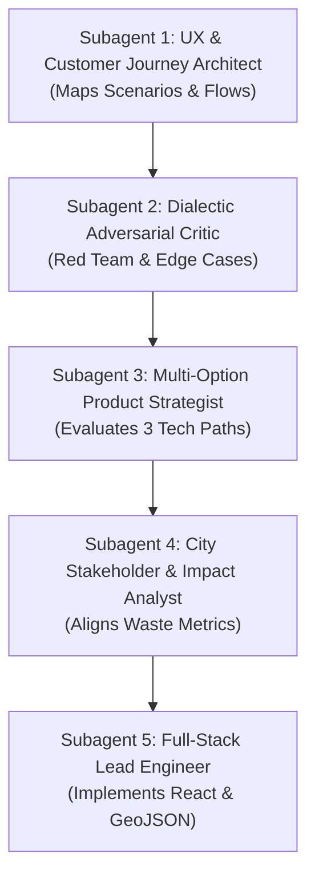

# Customer Journey Analysis, GitHub Gap Audit & Multi-Agent Team Architecture

> **Target Application**: Boston Circular Economy Platform  
> **Reference Prototype**: [`circular-economy-prototype.vercel.app/flow-a`](https://circular-economy-prototype.vercel.app/flow-a)  
> **Target Repository**: [`codeforboston/boston-circular-economy`](https://github.com/hwillGIT/boston-circular-economy)

---

## 1. Deep Analysis of the Live Prototype & Customer Journeys

After a line-by-line inspection of the live Vercel prototype application (`circular-economy-prototype.vercel.app`), here are the core user personas, customer journeys, and friction point findings:

### A. The Primary Target Persona

- **Name**: _"Jordan"_
- **Demographics**: Boston resident, MBTA transit commuter, non-car owner. College student or young professional.
- **Core Motivation**: Wants to mend, repair, or responsibly rehome items (clothing, small electronics) without expensive fees or long transit trips.

---

### B. Customer Journey Flows

```
                             ┌──────────────────────────────────────┐
                             │       PRIMARY PERSONA: JORDAN        │
                             │ (Boston Resident, MBTA Transit, Carless) │
                             └──────────────────┬───────────────────┘
                                                │
                       ┌────────────────────────┴────────────────────────┐
                       ▼                                                 ▼
             FLOW A: BROKEN TOASTER                            FLOW B: OLD SHIRT
        (Small Appliance Repair Journey)                  (Clothing Mending & Swap Journey)
                       │                                                 │
          ┌────────────┴────────────┐                       ┌────────────┼────────────┐
          ▼                         ▼                       ▼            ▼            ▼
     PATH A1:                  PATH A2:                PATH B1:     PATH B2:     PATH B3:
   Professional              Fix-It Clinic /          Professional  Mending      Clothing
   Repair Shop              Community Workshop        Tailor Shop   Circle        Swap
 (JP Appliance Repair)     (Boston Center for Arts) (Same-Day)  (JP Circle) (Looptworks)
```

#### Flow A: Small Appliance Journey (Broken Toaster)

- **Problem & Emotional Barrier**: Toaster stops working. Jordan performs basic troubleshooting (unplug/replug). Feels uncertain (_"Is it worth repairing? Will a shop accept a cheap toaster?"_). Without clear guidance, Jordan throws the toaster in the trash with vague guilt.
- **Customer Options Provided**:
  1. **Professional Repair (Path A1)**: JP Appliance Repair (Locally owned, walk-in/call ahead, same-day service).
  2. **Community Skill-Share / Fix-It Clinic (Path A2)**: Boston Center for the Arts Fix-It Clinic / Somerville Repair Cafe (Free, volunteer technicians from MIT/Northeastern, learn to repair it yourself).
- **Direct Impact**: Toaster diverted from landfill; resident gains mending skills.

#### Flow B: Textiles & Clothing Journey (Old Shirt)

- **Problem & Friction**: Shirt has a torn seam. Jordan wants to mend it or find it a new owner.
- **Customer Options Provided**:
  1. **Professional Tailor (Path B1)**: Expert alteration shops with transparent pricing and same-day seam mending.
  2. **Mending Circle (Path B2)**: JP Mending Circle at Loring-Greenough House (Jamaica Plain community skill share).
  3. **Clothing Swap (Path B3)**: Looptworks Boston Swap at The Yard, South End (Bring 3 items to swap, no cash exchanged).
- **Direct Impact**: Shirt kept out of landfill; community reuse connection established.

---

### C. Embedded Friction Points & Stakeholder Questions

1. **Geographic Opacity**: Residents do not know where repair facilities exist relative to MBTA subway lines.
2. **Cost & Viability Uncertainty**: Residents self-screen out small repairs because costs are unknown.
3. **Data Freshness Gap**: Community events (Fix-It Cafes) have irregular schedules not indexed by Google Search.
4. **Questions for City of Boston**:
   - Are there documented repair service deserts by neighborhood?
   - What reporting metrics does the City need for Year-1 waste diversion reporting?
   - Should this data integrate into City 311 / Boston.gov infrastructure?

---

## 2. GitHub Codebase Gap Analysis (What is Currently Missing)

Comparing the live prototype against the current GitHub repository (`G:\Projects\boston-circular-economy`):

| Feature / Artifact            |   Present in Live Prototype?    | Present in GitHub Repo? | Action Required                                                   |
| :---------------------------- | :-----------------------------: | :---------------------: | :---------------------------------------------------------------- |
| **User Personas & Scenarios** | ✅ Yes (Jordan, Toaster, Shirt) |     ❌ **Missing**      | Add Persona & Scenario specifications to `README.md` and `docs/`. |
| **Customer Journey Flow UI**  |    ✅ Yes (Flow A & Flow B)     |     ❌ **Missing**      | Implement React Flow components in `client/src/pages/`.           |
| **MBTA Transit Filters**      |   ✅ Yes (Filter by T access)   |     ❌ **Missing**      | Add MBTA filter logic to front-end spatial components.            |
| **Cost & Appointment Badges** |  ✅ Yes (Free, Walk-in, Hours)  |     ❌ **Missing**      | Extend GeoJSON feature properties schema.                         |
| **Dual ETL Data Pipeline**    |           ⚠️ Partial            |   ✅ **Implemented**    | `etl/google_places.py` & `etl/osm.py` ready.                      |
| **50m Merge Deduplicator**    |           ⚠️ Partial            |   ✅ **Implemented**    | `etl/merge_processor.py` ready.                                   |
| **Express Server API Proxy**  |           ⚠️ Partial            |   ✅ **Implemented**    | `server/routes/api.js` ready.                                     |

---

## 3. Multi-Agent Agentic Team Framework

To achieve rigorous **adversarial thinking** and **multi-option evaluation**, we establish a 5-role subagent team architecture:



### Subagent Team Roster & Goals

#### 1. User Experience (UX) Architect

- **Goal**: Translate prototype user flows (Flow A/B, Persona Jordan) into modular React UI wireframes.
- **Focus**: MBTA filter accessibility, cost range transparency, walk-in vs. appointment clarity.

#### 2. Dialectic Adversarial Critic (Red Team / Devil's Advocate)

- **Goal**: Stress-test user flows, data schemas, and edge cases.
- **Key Questions**:
  - What happens when a user brings an item a repair cafe CANNOT fix?
  - How do we handle stale data for irregular Fix-It Clinics?
  - How do we prevent low-income neighborhoods from being repair deserts?

#### 3. Multi-Option Product Strategist

- **Goal**: Formulate 3 distinct architectural implementation options for the team to choose from:
  - **Option 1 (Lightweight SPA)**: Pure React client rendering pre-merged GeoJSON snapshot.
  - **Option 2 (Full-Stack Portal)**: Express + React with user submission form for community Fix-It Clinics.
  - **Option 3 (City 311 Integrated)**: Enterprise API integration directly pushing waste diversion metrics to Boston.gov.

#### 4. City Stakeholder & Impact Analyst

- **Goal**: Align data structures with City of Boston Environment Department metrics.
- **Metrics**: Tonnage diverted, geographic search distribution by ZIP code, repair vs. donation ratios.

#### 5. Full-Stack Lead Engineer

- **Goal**: Build production React pages in `client/src/pages/`, write unit tests, and integrate Express proxy endpoints.

---

## 4. Proposed Execution Roadmap

```
Phase 1: Customer Journey Specs ──► Phase 2: React Page Components ──► Phase 3: GeoJSON MBTA Filtering
(Document Persona & Scenarios)       (Flow A & Flow B Pages)            (Spatial Proximity Math)
```

1. **Phase 1**: Document Customer Journeys (Persona Jordan, Flow A, Flow B) in `docs/customer_journeys_and_specs.md`.
2. **Phase 2**: Implement Flow A (Small Appliances) and Flow B (Textiles) pages inside `client/src/pages/`.
3. **Phase 3**: Connect front-end flow filters to pre-merged GeoJSON data served by `server/routes/api.js`.
