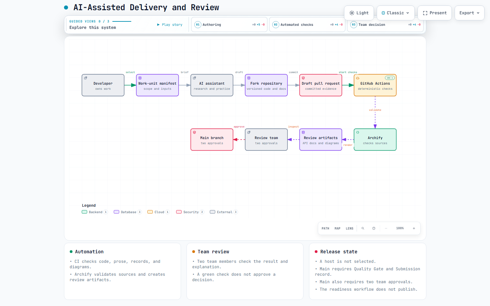
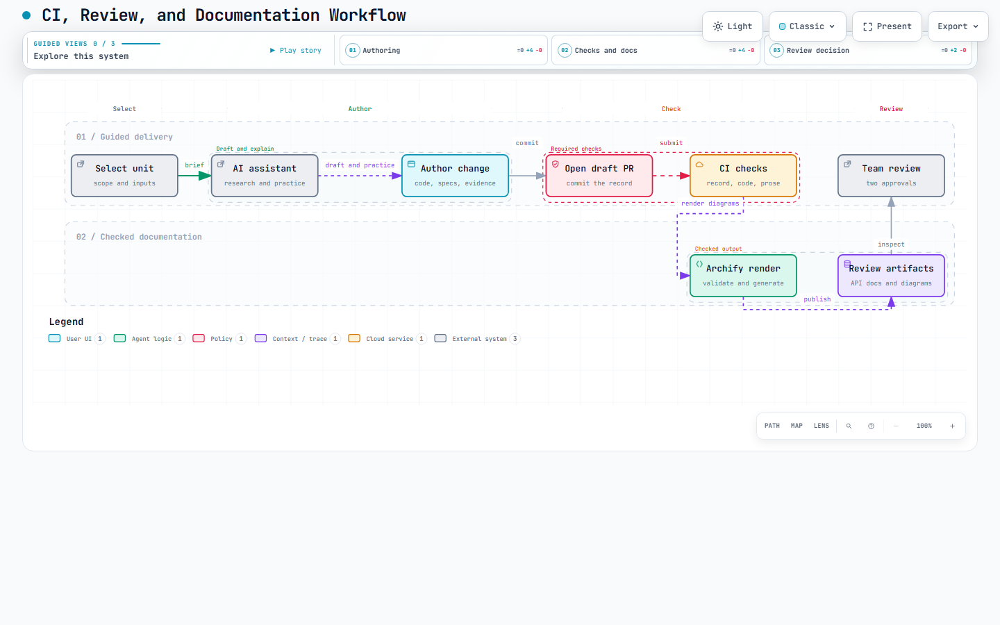

# Archify diagrams

This directory stores diagrams used during team review.
Each diagram has a JSON source and a checked PNG review image.
The PNG is a light browser capture of the rendered diagram.
CI creates an interactive HTML page and uploads it as a build artifact.
The repository does not store the interactive page.

| Diagram             | JSON source                        | Checked PNG                       | Purpose                                                    |
| ------------------- | ---------------------------------- | --------------------------------- | ---------------------------------------------------------- |
| Delivery and review | `agent-delivery.architecture.json` | `agent-delivery.architecture.png` | Shows people, checks, and evidence on the route to review. |
| CI workflow         | `ci-review.workflow.json`          | `ci-review.workflow.png`          | Shows the route from a work unit to team review.           |





## CI contract

CI checks out [Archify](https://github.com/tt-a1i/archify) at the commit in `manifest.json`.
It installs the renderer with its lockfile.
It validates each JSON source and creates an ignored HTML page.
It checks the PNG type and minimum image size.
The manifest records the JSON source hash for each PNG.
The check fails when a source changes without a refreshed review image record.

CI uploads the JSON sources, PNG images, and interactive HTML pages.
The build artifact supports detailed inspection.
The checked PNG supports inspection from the pull request file list.

On a pull request, CI also creates an architecture comparison artifact.
The artifact shows changes between the base and head sources.
It supports team review and does not approve a merge.

## Refresh a diagram

Clone the pinned renderer into the ignored local directory.

```sh
git clone https://github.com/tt-a1i/archify .archify-tool
git -C .archify-tool checkout 18911058008f17dc065af23a2cdc9bfeff6d3f7a
npm ci --prefix .archify-tool/archify --no-audit --no-fund
```

1. Update the JSON source and `meta.output` path.
2. Update the matching `render_output` value in `manifest.json`.
3. Run the diagram check.
4. Run the browser check for the rendered HTML page.
5. Copy its 1440 by 900 light PNG over the checked review image.
6. Put the JSON SHA-256 value in `review_image_source_sha256`.
7. Run the diagram check again.
8. Commit the JSON source, manifest, and PNG image.

```powershell
$env:ARCHIFY_ROOT = '.archify-tool/archify'
node .agents/scripts/check_archify_diagrams.mjs
node .archify-tool/archify/bin/archify.mjs visual-check docs/diagrams/<name>.rendered.<type>.html --json
Get-FileHash -Algorithm SHA256 -LiteralPath docs/diagrams/<name>.<type>.json
```

Do not commit a rendered HTML page, browser receipt, or contact sheet.
Inspect the PNG and the uploaded page before you describe a visual review as passed.

## AI prompt

```text
Read docs/diagrams/manifest.json, the named JSON source, and the changed code.
List the source facts for every node and connection you propose.
Use short labels and one clear route through the diagram.
Do not claim a relationship that the source files do not show.
Run the diagram check and the browser check.
Show the changed JSON, manifest, and PNG files.
Ask me to trace one changed connection from its source to its result.
Change one condition and ask me to predict the result.
Wait for my answer before you correct it.
Do not write my explanation or claim that I understand the change.
```

## Pinned renderer

The workflow uses `tt-a1i/archify` at commit `18911058008f17dc065af23a2cdc9bfeff6d3f7a`.
Archify is licensed under MIT.
Update the manifest, workflow pin, source hash, PNG, and renderer revision together.
