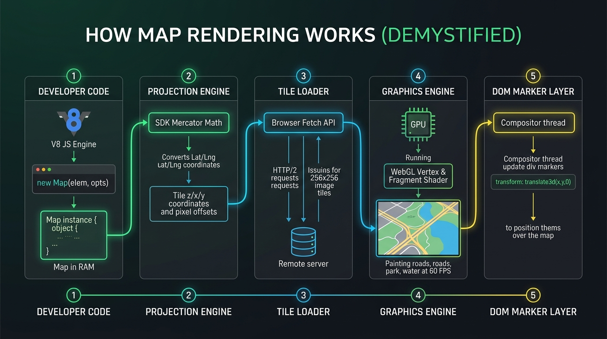

# How Map Rendering Actually Works (Demystified)

> **The Complete Journey from Lines of Code to Physical Screen Pixels**  
> **Target Audience**: Developers who want to connect their code actions line-by-line to internal engine rendering mechanics and physical UI painting.

---

## 1. High-Quality Visual Architecture: How Map Rendering Works

Here is the high-resolution Nano Banana generated visual architecture diagram demystifying the complete 5-stage rendering pipeline:



---

## 2. Who & What Draws the Map (Deep Dive into the 5 Engines)

### Engine 1: The JavaScript Map Instance (Who holds state?)

When your code executes:

```javascript
const map = new google.maps.Map(document.getElementById('map'), {
  center: { lat: 42.3601, lng: -71.0589 },
  zoom: 12,
});
```

- **Who executes this?** The browser's V8 JavaScript Engine.
- **What gets created?** A JavaScript object in RAM that maintains internal state:
  - `center`: `{ lat: 42.3601, lng: -71.0589 }`
  - `zoom`: `12`
  - `bounds`: Calculated visible geographic rectangle `[South, West, North, East]`
  - `container`: Reference to `<div id="map">` in the HTML DOM.

---

### Engine 2: The Mercator Projection Engine (Who does the math?)

Before anything can be drawn on screen, real-world spherical GPS coordinates MUST be converted into flat 2D pixel coordinates.

- **Who does this?** The Mapping SDK's internal **Projection Module**.
- **The Exact Formula**:
  $$\text{pixelX} = \text{scale} \times \left(\frac{\text{lng} + 180}{360}\right)$$
  $$\text{pixelY} = \text{scale} \times \left(1 - \frac{\ln(\tan(\text{lat} \cdot \frac{\pi}{180}) + \sec(\text{lat} \cdot \frac{\pi}{180}))}{\pi}\right) / 2$$
  _(where $\text{scale} = 256 \times 2^{\text{zoom}}$)_

- **What it calculates**:
  - Boston City Hall `[42.3601, -71.0589]` at Zoom 12 is calculated to lie inside **Tile `12 / 1215 / 1537`** at pixel offset `{ x: 120px, y: 84px }` relative to the tile's top-left corner.

---

### Engine 3: The Tile Loader & Network Manager (Who gets the images?)

Now that the Projection Engine knows which tiles are required to fill your `<div id="map">` (e.g. 6 tiles for an $800 \times 600$ container):

- **Who fetches data?** The SDK's internal **Network Manager** issuing asynchronous HTTP/2 GET requests to CDN servers.
- **What is fetched?**
  - **In Raster Mode (Leaflet / OSM)**: Downloads pre-rendered `.png` images: `https://tile.openstreetmap.org/12/1215/1537.png`.
  - **In Vector Mode (Google Maps JS / Mapbox / MapLibre)**: Downloads binary Mapbox Vector Tile (`.pbf` / Protobuf) files containing raw line paths for roads and polygon paths for buildings.

---

### Engine 4: The Graphics Painting Engine (Who paints the screen?)

This is where raw data turns into visual artwork on your monitor!

- **Who paints pixels?** The physical **GPU (Graphics Processing Unit / Graphics Card)** inside the user's computer or smartphone.
- **How it renders**:
  - **WebGL Mode**: The SDK attaches an HTML `<canvas>` element inside `<div id="map">` and initializes a WebGL 2.0 context. The GPU executes two shader programs 60 times per second ($60 \text{ FPS}$):
    1. **Vertex Shader**: Translates 3D line geometries (roads, rivers, building heights) into screen clip space.
    2. **Fragment Shader**: Fills pixels with exact hex colors (`#10b981` for parks, `#38bdf8` for water, `#ffffff` for roads).

---

### Engine 5: The DOM Marker Compositor & Pan/Zoom Event Loop (Who moves pins?)

When you add custom HTML pins onto the map:

```javascript
new AdvancedMarkerElement({ map, position: { lat: 42.3438, lng: -71.0734 }, content: pinElement });
```

- **Who manages pins?** The Browser's **DOM Compositor Thread**.
- **What happens when the user drags the mouse (Panning)?**
  1. User holds mouse button and moves mouse across the map `<div>`.
  2. Browser fires high-frequency `mousemove` events.
  3. The SDK updates internal `center.lat` and `center.lng` state.
  4. The SDK recalculates pixel positions for all markers.
  5. The SDK updates marker CSS properties directly via GPU hardware acceleration:
     `style="transform: translate3d(340px, 220px, 0);"`
  6. The GPU compositing layer moves the pin element without causing heavy browser layout reflows!

---

## 3. Connecting Developer Actions to UI Results

| Developer Code Action         | Internal Engine Component Triggered                           | What Gets Changed on Screen                                                                     |
| :---------------------------- | :------------------------------------------------------------ | :---------------------------------------------------------------------------------------------- |
| `map.setCenter({ lat, lng })` | Engine 1 (State) $\rightarrow$ Engine 2 (Projection Math)     | Recalculates visible bounding box and shifts canvas view.                                       |
| `map.setZoom(15)`             | Engine 2 (Projection) $\rightarrow$ Engine 3 (Tile Loader)    | Fetches higher-detail zoom 15 tiles; scales map geometry $2\times$.                             |
| `new AdvancedMarkerElement()` | Engine 2 (Projection) $\rightarrow$ Engine 5 (DOM Compositor) | Calculates Lat/Lng to pixel offset $(x, y)$ and appends HTML element with `translate3d(x,y,0)`. |
| User drags map with mouse     | Engine 5 (Events) $\rightarrow$ Engine 4 (GPU Render Loop)    | GPU repaints WebGL canvas lines and shifts HTML markers smoothly at 60 FPS.                     |
