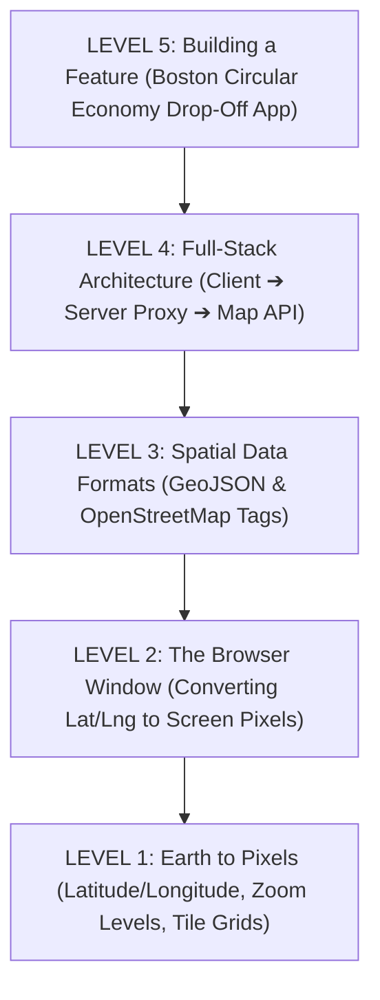
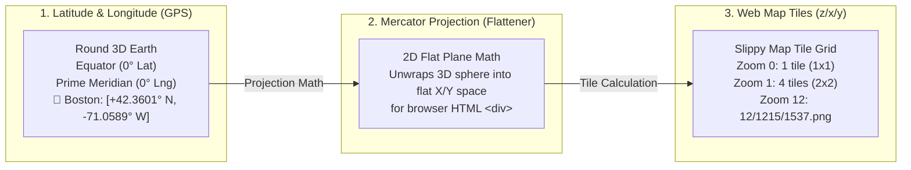
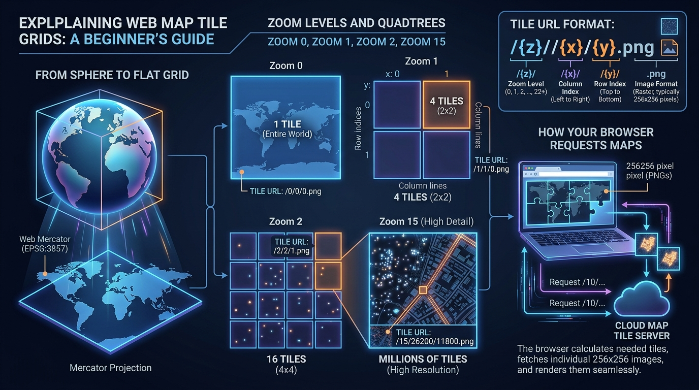
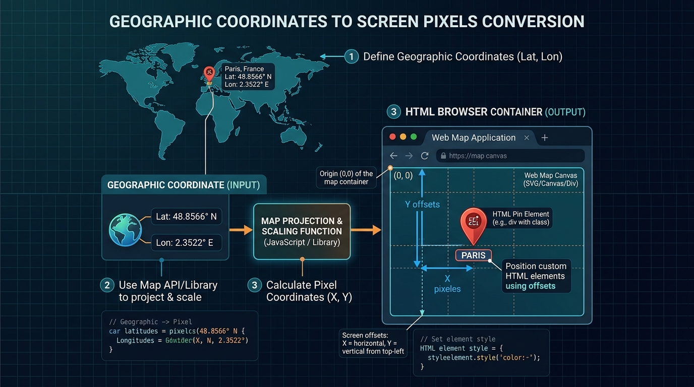
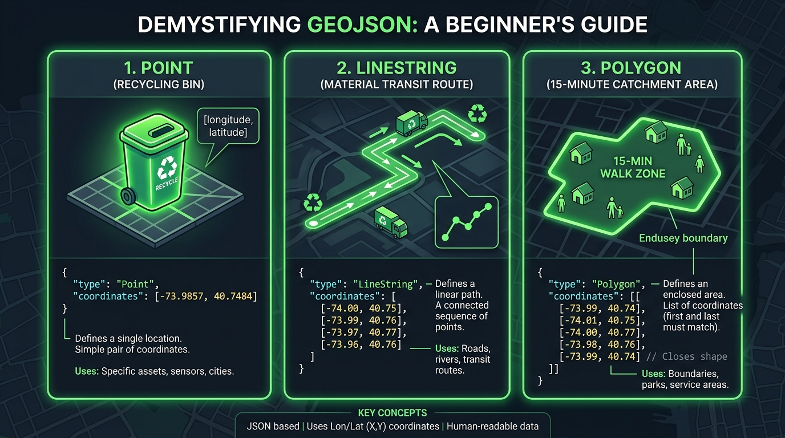
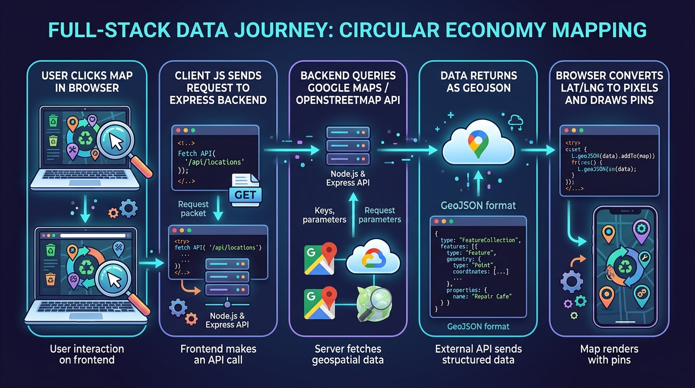

# The Novice Developer's Visual Guide to Geographic Mapping APIs
> **From First Principles to Building Circular Economy Applications**

Welcome! If you are a developer who has never built a mapping application before, geographic APIs like Google Maps, OpenStreetMap, or Mapbox can feel overwhelming with technical jargon like *Mercator projections, vector tiles, bounding boxes, and Overpass QL*.

This visual guide breaks everything down into **plain English, step-by-step visual diagrams, and intuitive analogies**.

---

## The 5 Visual Levels of a Mapping Application



---

## LEVEL 1: Earth to Pixels (How Maps Work Under the Hood)

Here is the complete visual explainer showing how the round 3D Earth is mapped into 2D grid coordinates and image map tiles:



---

### 1. Latitude and Longitude: Earth's GPS Address
Imagine planet Earth wrapped in a grid of invisible lines:
- **Latitude (Lat)**: Measures **North / South** distance from the Equator ($0^\circ$).
  - Range: $-90^\circ$ (South Pole) to $+90^\circ$ (North Pole).
  - Boston, MA is at **$+42.3601^\circ$ North**.
- **Longitude (Lng)**: Measures **East / West** distance from the Prime Meridian ($0^\circ$ in Greenwich, UK).
  - Range: $-180^\circ$ (West) to $+180^\circ$ (East).
  - Boston, MA is at **$-71.0589^\circ$ West**.

---

### 2. The Web Map Tile Grid (`/{z}/{x}/{y}.png`)
How does a browser render a map of the entire planet without crashing? **Slippy Map Tiles!**

Instead of loading one giant 50-Gigabyte image of Earth, web maps break the planet into thousands of small **256x256 pixel square image tiles**.



#### How Zoom Levels Work:
- **Zoom Level 0**: The entire planet fits inside **1 single tile** (`0/0/0.png`).
- **Zoom Level 1**: Earth is split into **4 tiles** ($2 \times 2$ grid).
- **Zoom Level 2**: Earth is split into **16 tiles** ($4 \times 4$ grid).
- **Zoom Level $Z$**: Earth is split into $2^Z \times 2^Z$ tiles!
- At **Zoom Level 15** (Street view in Boston), the browser only downloads the 6 or 9 tiles currently visible inside your screen window!

```
Tile URL Structure: https://tile.openstreetmap.org/{zoom}/{x_tile}/{y_tile}.png
Example (Boston):   https://tile.openstreetmap.org/12/1215/1537.png
```

---

## LEVEL 2: The Browser Window (Lat/Lng ➔ Screen Pixels)

When you look at a map on a website, the browser runs a mathematical conversion called **Mercator Projection** to turn real-world coordinates into pixel locations inside an HTML `<div>`.



---

## LEVEL 3: Spatial Data Formats Demystified (GeoJSON)



---

## LEVEL 4: Full-Stack Architecture (How Your App Talks to APIs)



---

## Interactive Learning Sandbox

Test all these concepts visually in our interactive developer sandbox:

- **Web App Sandbox**: [index.html](file:///C:/Users/huber/.gemini/antigravity/scratch/google_maps_circular_economy_guide/index.html)
- **Features**: Live Tile Grid Inspector, Lat/Lng ➔ Pixel Converter, GeoJSON Visualizer, and Overpass Tag Explorer.
