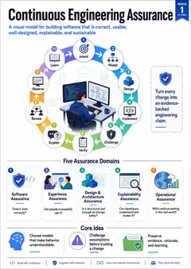
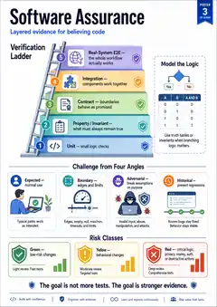
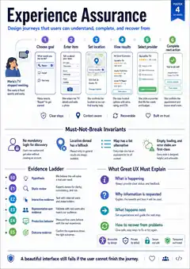
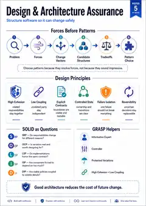
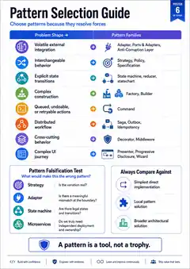
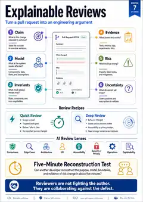
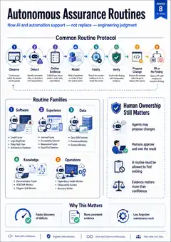

# Continuous Engineering Assurance Poster Series

A visual discussion and onboarding set for the Circular Economy engineering team. These posters are working aids for brainstorming, development, and review—not finalized project policy.

The repository contains lightweight WebP preview copies for convenient browsing. High-resolution originals are linked below from Slack.

## Posters

### 1. Continuous Engineering Assurance

### 2. From Ticket to Trust

### 3. Software Assurance

### 4. Experience Assurance

### 5. Design & Architecture Assurance

### 6. Pattern Selection Guide

### 7. Explainable Reviews

### 8. Autonomous Assurance Routines

## Themes

- A shared lifecycle: **Intent → Model → Design → Implement → Challenge → Verify → Explain → Review → Observe → Learn**
- Layered software and experience evidence
- Modularity, SOLID, GRASP, pattern selection, and architecture fitness
- Explainable pull-request and review practices
- Autonomous routines that support—not replace—human ownership

## High-resolution Slack versions

- [Poster 1 — Continuous Engineering Assurance](https://cfb-public.slack.com/files/U01HQB0EX5G/F0BQAAXHJJH/01-continuous-engineering-assurance.png)
- [Poster 2 — From Ticket to Trust](https://cfb-public.slack.com/files/U01HQB0EX5G/F0BQC29GXSS/02-from-ticket-to-trust.png)
- [Poster 3 — Software Assurance](https://cfb-public.slack.com/files/U01HQB0EX5G/F0BQE0HPUR0/03-software-assurance.png)
- [Poster 4 — Experience Assurance](https://cfb-public.slack.com/files/U01HQB0EX5G/F0BQAB1B2ER/04-experience-assurance.png)
- [Poster 5 — Design & Architecture Assurance](https://cfb-public.slack.com/files/U01HQB0EX5G/F0BPYKLM61M/05-design-architecture-assurance.png)
- [Poster 6 — Pattern Selection Guide](https://cfb-public.slack.com/files/U01HQB0EX5G/F0BQFUZ48QZ/06-pattern-selection-guide.png)
- [Poster 7 — Explainable Reviews](https://cfb-public.slack.com/files/U01HQB0EX5G/F0BQHMAVDDJ/07-explainable-reviews.png)
- [Poster 8 — Autonomous Assurance Routines](https://cfb-public.slack.com/files/U01HQB0EX5G/F0BR8BQSVT2/08-autonomous-assurance-routines.png)
