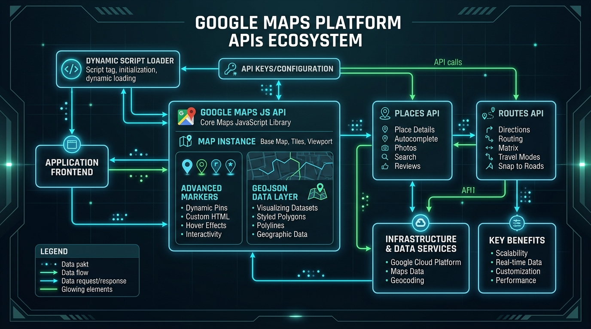
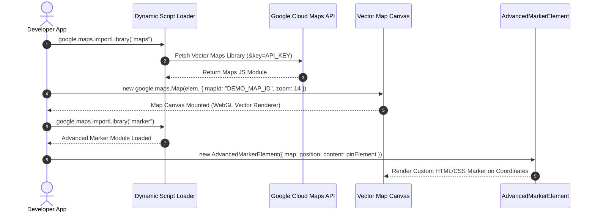
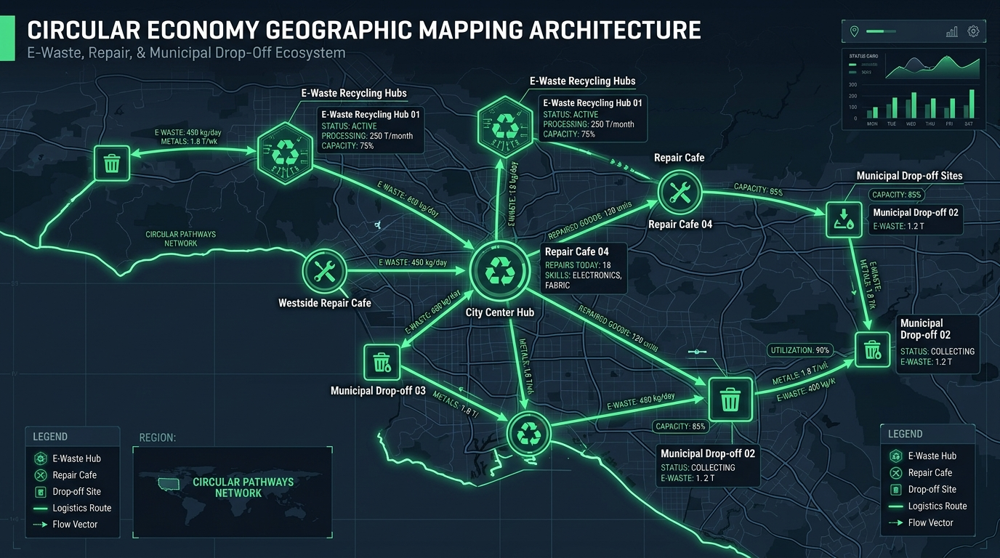
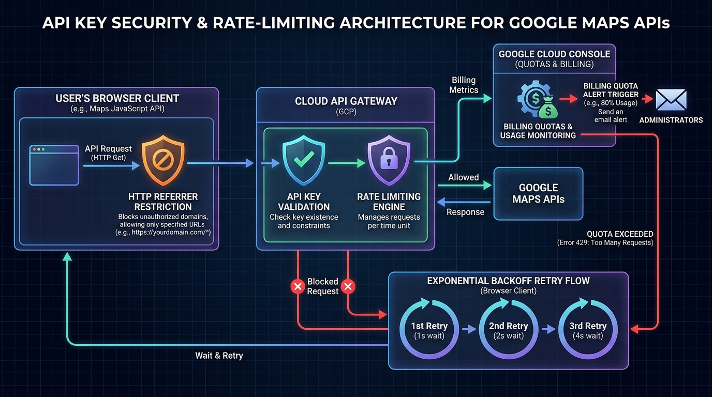

# Google Maps Platform Developer Visual Guide & Master Handbook
> **Special Focus**: Building Location-Aware Circular Economy Applications

---

## 1. Visual Architecture & Ecosystem Overview

Google Maps Platform consists of several interconnected location services. For developers building a **Circular Economy Application** (such as mapping recycling facilities, community repair cafes, material drop-off points, and reverse logistics), four core APIs form the technical foundation:



### Core APIs for Circular Economy Applications

| API Service | Primary Use Case in Circular Economy | Key Function / Feature |
| :--- | :--- | :--- |
| **Maps JavaScript API** | Interactive Map Canvas & Node Display | Dynamic Library Loader, `AdvancedMarkerElement`, `PinElement`, Vector Rendering |
| **Places API (New)** | Hub & Drop-Off Discovery | Nearby Search, Place Details, Operating Hours, Accessibility Attributes |
| **Routes API** | Reverse Logistics & Waste Pickups | Eco-Friendly Routing, Fuel Consumption Estimation, Multi-Stop Optimization |
| **Geocoding API** | Address Conversion & Reverse Lookup | Turning user addresses into Lat/Lng coordinates for drop-off booking |

---

## 2. Dynamic Initialization & Lifecycle Flowchart

To initialize Google Maps Platform in modern web applications, use the **Dynamic Library Import** method (`importLibrary`) rather than legacy monolithic script tag injections.



---

## 3. Circular Economy Visual Mapping Case Study

In circular economy platforms, geographic data represents **nodes** (facilities) and **vectors** (material flow). 



### Architecture Patterns for Circular Nodes & Routes:
1. **Facility Nodes (`AdvancedMarkerElement`)**: Represent recycling drop-offs, battery collection boxes, and repair hubs with real-time capacity badges.
2. **Material Transit Routes (`GeoJSON Data Layer`)**: Render vector lines connecting waste origin to recovery plants, color-coded by material type (e.g. E-Waste, Organic, Textile).
3. **Logistics Optimization (`Routes API`)**: Compute eco-friendly driving paths that minimize fuel and CO₂ emissions.

---

## 4. Dialectic Architectural Analysis & Technical Options

When architecting geographic applications, developers face three fundamental trade-offs:

```
                      DIALECTIC DECISION MATRIX
                                  │
    ┌─────────────────────────────┼─────────────────────────────┐
    ▼                             ▼                             ▼
Option A: Markers            Option B: GeoJSON             Option C: WebGL Layer
(AdvancedMarkerElement)      (map.data Vector Layer)        (Deck.gl / OverlayView)
Rich HTML/CSS DOM Interactivity High Native Performance      Massive Datasets (>10k)
Best for <1,000 Nodes        Best for Transit Routes       Best for Regional Density Maps
```

### Comparative Architectural Matrix

| Feature Dimension | Option A: AdvancedMarkerElement | Option B: GeoJSON Data Layer | Option C: WebGL (Deck.gl) |
| :--- | :--- | :--- | :--- |
| **Max Recommended Nodes** | ~1,000 active DOM elements | ~10,000 vector shapes | >100,000 data points |
| **Custom Styling Capabilities** | Complete HTML/CSS & SVG control | Native vector stroke/fill rules | GPU Shader & Custom WebGL |
| **Event Handling** | Native DOM click/hover listeners | Geometry spatial click events | WebGL Raycasting listeners |
| **Bundle Size Impact** | 0 KB (Built into Maps JS SDK) | 0 KB (Built into Maps JS SDK) | ~150 KB external library |

> [!TIP]
> **Recommended Synthesis for Circular Economy Apps**:
> Combine **Option B (GeoJSON)** for spatial flow lines and transit routes with **Option A (AdvancedMarkerElement)** for interactive drop-off location cards.

---

## 5. Annotated Code Masterclass

### Lesson 1: Dynamic Import & Map Initialization
```javascript
// Step 1: Dynamic Library Loader (Formatted & Demystified)
(inlineLoader => {
  let loaderPromise;
  let scriptElement;
  let keyParams;

  const apiName = "The Google Maps JavaScript API";
  const globalNamespace = "google";
  const importFn = "importLibrary";
  const callbackName = "__ib__";

  const win = window;
  const googleObj = win[globalNamespace] || (win[globalNamespace] = {});
  const mapsObj = googleObj.maps || (googleObj.maps = {});
  const requestedLibraries = new Set();
  const searchParams = new URLSearchParams();

  const loadScript = () => {
    if (loaderPromise) return loaderPromise;

    loaderPromise = new Promise(async (resolve, reject) => {
      scriptElement = document.createElement("script");
      searchParams.set("libraries", [...requestedLibraries] + "");

      for (keyParams in inlineLoader) {
        searchParams.set(
          keyParams.replace(/[A-Z]/g, match => "_" + match[0].toLowerCase()),
          inlineLoader[keyParams]
        );
      }

      searchParams.set("callback", globalNamespace + ".maps." + callbackName);
      scriptElement.src = `https://maps.${globalNamespace}apis.com/maps/api/js?` + searchParams;
      mapsObj[callbackName] = resolve;
      scriptElement.onerror = () => (loaderPromise = reject(Error(apiName + " could not load.")));

      scriptElement.nonce = document.querySelector("script[nonce]")?.nonce || "";
      document.head.append(scriptElement);
    });

    return loaderPromise;
  };

  if (mapsObj[importFn]) {
    console.warn(apiName + " only loads once. Ignoring:", apiName);
  } else {
    mapsObj[importFn] = (libName, ...args) =>
      requestedLibraries.add(libName) &&
      loadScript().then(() => mapsObj[importFn](libName, ...args));
  }
})({
  key: "YOUR_RESTRICTED_API_KEY",
  v: "weekly"
});

// Step 2: Initialize Vector Map
async function initCircularMap() {
  const { Map } = await google.maps.importLibrary("maps");

  const map = new Map(document.getElementById("map"), {
    zoom: 13,
    center: { lat: 37.7749, lng: -122.4194 },
    mapId: "DEMO_MAP_ID", // Map ID is required for Vector Rendering & Advanced Markers
  });

  return map;
}
```

### Lesson 2: Creating Advanced HTML Pin Markers
```javascript
async function addRecyclingHubMarker(map, lat, lng, capacityLabel) {
  const { AdvancedMarkerElement, PinElement } = await google.maps.importLibrary("marker");

  // Create a customized pin element
  const pin = new PinElement({
    background: "#10b981", // Emerald green theme
    borderColor: "#06b6d4",
    glyphColor: "#ffffff",
    scale: 1.2
  });

  // Create HTML container badge overlay
  const container = document.createElement("div");
  container.className = "custom-marker-wrapper";
  container.appendChild(pin.element);

  const badge = document.createElement("span");
  badge.className = "capacity-badge";
  badge.textContent = capacityLabel;
  container.appendChild(badge);

  // Instantiate AdvancedMarkerElement
  const marker = new AdvancedMarkerElement({
    map,
    position: { lat, lng },
    title: "E-Waste Recycling Hub",
    content: container
  });

  return marker;
}
```

### Lesson 3: Streaming & Styling GeoJSON Material Flows
```javascript
function renderGeoJsonMaterialFlows(map, geoJsonData) {
  // Load GeoJSON into the built-in Data Layer
  map.data.addGeoJson(geoJsonData);

  // Style vector features dynamically based on feature properties
  map.data.setStyle((feature) => {
    const materialCategory = feature.getProperty("materialCategory");
    
    let strokeColor = "#10b981"; // Default green
    if (materialCategory === "e-waste") strokeColor = "#f59e0b";
    if (materialCategory === "hazardous") strokeColor = "#ef4444";

    return {
      strokeColor: strokeColor,
      strokeWeight: 4,
      strokeOpacity: 0.85
    };
  });

  // Spatial Click Event Listener
  map.data.addListener("click", (event) => {
    const volume = event.feature.getProperty("dailyVolume");
    alert(`Material Flow Volume: ${volume} kg/day`);
  });
}
```

---

## 6. API Key Security & Billing Guardrails

Protecting your API key and managing costs is critical before going to production.



### Production Security Checklist

1. **HTTP Referrer Restrictions**: In Google Cloud Console, restrict your client-side API key to your exact web domain (e.g. `https://your-circular-app.com/*`).
2. **API Restrictions**: Limit the API key so it can ONLY invoke *Maps JavaScript API*. Do not use the same key for Places/Routes web services on the client side.
3. **Backend Proxy Pattern**: Perform Places API & Routes API lookups from a server-side backend API gateway (e.g. Node.js/Python server) to hide secret credentials.
4. **Billing Alerts & Quotas**: Set daily request caps and dollar budget alerts in Google Cloud Billing to prevent surprise expenses.
5. **Exponential Backoff**: When making REST requests to Google APIs, handle `429 Too Many Requests` or `503 Service Unavailable` by retrying with exponential backoff:
   $$\text{Delay} = \min(\text{MaxDelay}, \text{BaseDelay} \times 2^{\text{attempt}}) + \text{jitter}$$

---

## 7. Interactive Developer Sandbox Access

Developers can explore the interactive version of this guide by running the local dev server:

- **Start**: `pnpm run dev` from the project root
- **Features**: Interactive map layer toggles, simulated eco-routing, code playground, and security score calculator.
