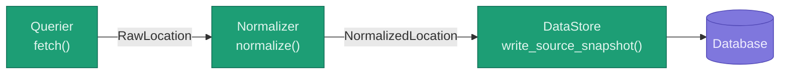

# ETL

Data pipeline for collecting, normalizing, and storing circular economy locations.

## Pipeline

Each pipeline has a **Querier** that fetches raw data from a source and a **Normalizer** that maps it to the shared schema. The **DataStore** is shared across pipelines and handles persistence.

## Adding a pipeline

1. Create a new directory under [`pipelines/`](pipelines/) for your source (e.g. `pipelines/openstreetmap/`)
2. Implement [`BaseQuerier`](base/querier.py) in `querier.py` — `fetch()` should return a `list[RawLocation]`, handling pagination internally
3. Implement [`BaseNormalizer`](base/normalizer.py) in `normalizer.py` — `normalize()` should map each [`RawLocation`](dtos.py) payload to a [`NormalizedLocation`](dtos.py)
4. Add a `test_pipeline.py` alongside them

See [`pipelines/example/`](pipelines/example/) for a reference implementation.

## Querier

The [`BaseQuerier`](base/querier.py) is implemented once per pipeline and fetches raw data from a single source. You implement it per source.

Key behaviors:

- **`fetch()`** — returns a `list[RawLocation]`, handling pagination internally so the rest of the pipeline doesn't need to think about it.

## Normalizer

The [`BaseNormalizer`](base/normalizer.py) is implemented once per pipeline and maps source-specific data to the shared schema. You implement it per source.

Key behaviors:

- **`normalize()`** — maps each `RawLocation` payload to a `NormalizedLocation`, translating source-specific field names and formats into the shared schema.

## DataStore

The [`DataStore`](base/ingester.py) reads and writes data for persistant storage. It is shared across all pipelines — you do not implement it per source.

Key behaviors:

- **`write_source_snapshot()`** — writes a list of `NormalizedLocation` records to the database.
  - **Update or Create** — records are keyed on `(data_source, data_source_id)`. Existing records are updated in place; new records are inserted.
  - **Source** — every record retains its `data_source` and `data_source_id`, which makes cross-source deduplication tractable later without requiring it now.

## Terms used in this document

- **data source** — an external provider of location data (e.g. Google Places, OpenStreetMap) that the app fetches records from.
- **source record / RawLocation** — a record exactly as it arrives from an external source, before any transformation. Preserves provenance.
- **provenance** — where a record came from and what shape it was in before the app changed it.
- **normalized / NormalizedLocation** — a source record that has been cleaned, re-shaped, and mapped to the app's shared schema. This is the curated version used internally.
- **pipeline** — the end-to-end sequence of steps (fetch → normalize → store) that brings data from one external source into the app.
- **querier** — the pipeline component that fetches raw records from a single source, handling pagination so the rest of the pipeline does not need to.
- **normalizer** — the pipeline component that maps a source record to the shared schema, translating source-specific field names and formats.
- **DataStore** — the shared component responsible for persisting normalized records; implemented once, not per source.
- **source snapshot** — the set of normalized records written from one source in a single run; records are updated or created keyed on source and source ID.
